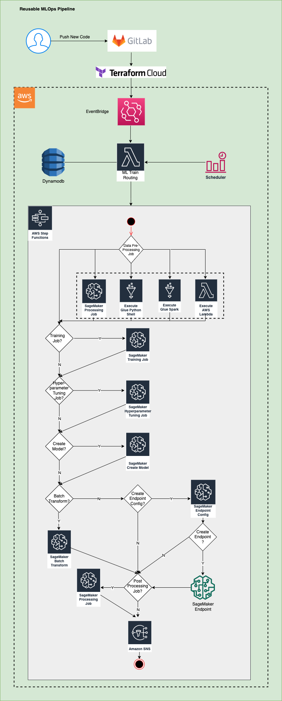
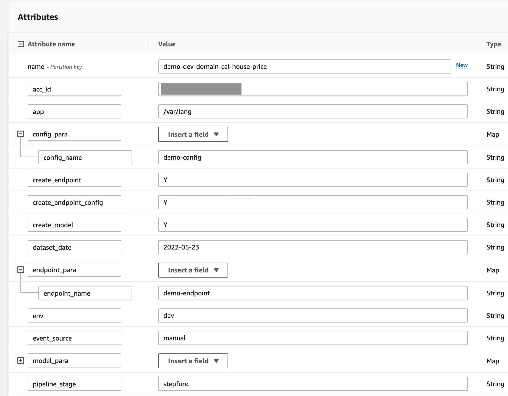
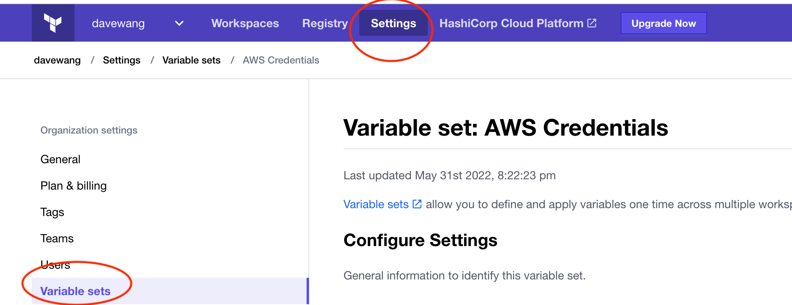
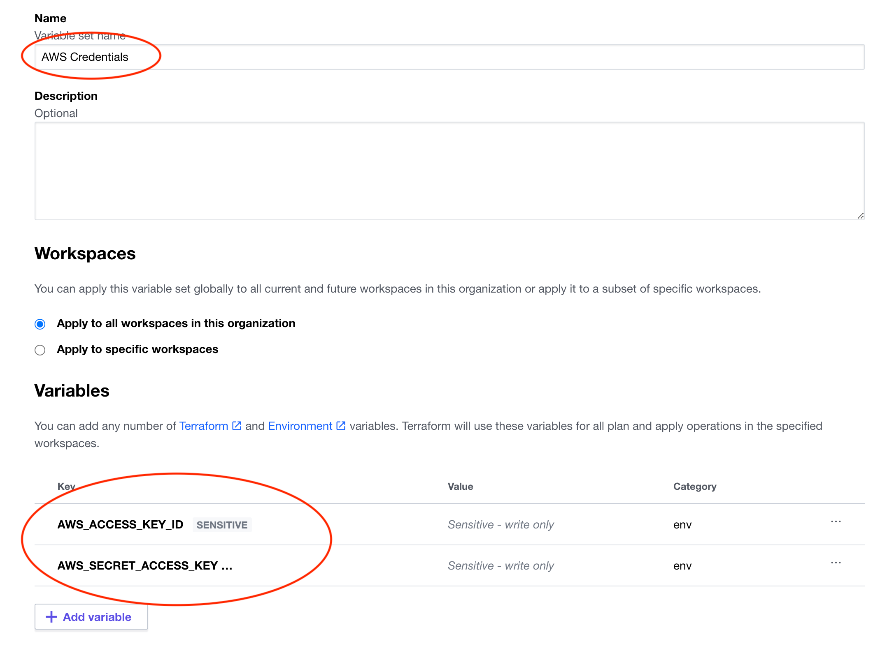
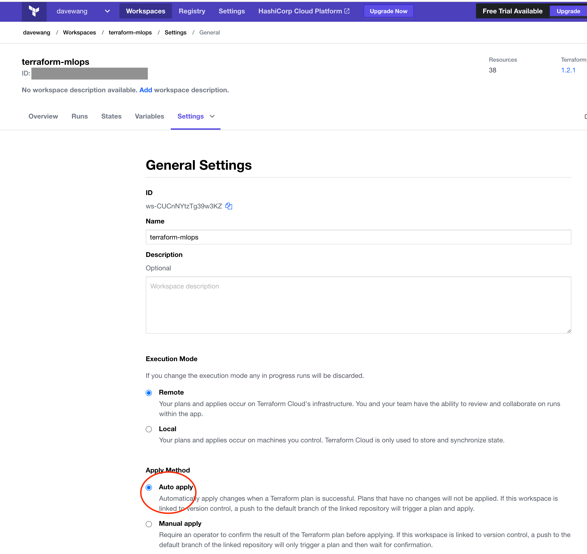
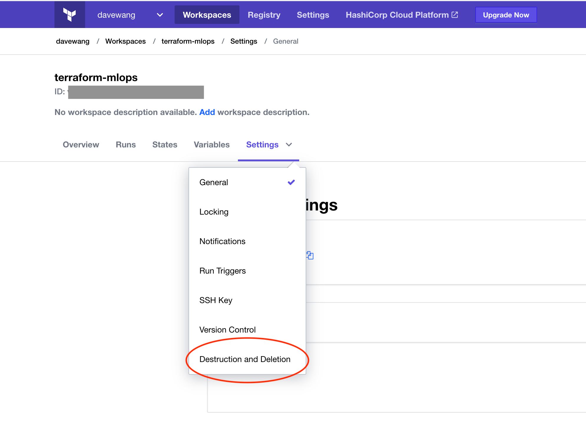

# Build a Reusable MLOps Framework for Amazon SageMaker Using AWS Step Functions, Amazon DynamoDB and Terraform

[AWS Step Functions](https://aws.amazon.com/step-functions/?step-functions.sort-by=item.additionalFields.postDateTime&step-functions.sort-order=desc) is a visual workflow service that developers can use to build MLOps pipelines using AWS services. Step Functions manages failures, retries, parallelization, service integrations, and observability. It's ideal tool to orchestrate ML workflow on Amazon SageMaker. [Amazon SageMaker](https://aws.amazon.com/sagemaker/) is a fully managed machine learning (ML) platform, to build, train and deploy your ML applications. [Amazon DynamoDB](https://aws.amazon.com/dynamodb/)is a fully managed, serverless, key-value NoSQL database. Combining AWS Step Functions, Amazon DynamoDB, and [Amazon Lambda](https://aws.amazon.com/lambda/), we can build a Reusable MLOps Framework for Amazon SageMaker.  

In this framework, [Gitlab](https://about.gitlab.com/) is used as vision control service and [Terraform Cloud](https://www.terraform.io/cloud-docs) is used as Infrastructure as code (IaC) tool. Terraform provisions AWS services.   

---
### Overview of solution  
The MLOps Framework is illustrated as below:

    

---
### Walkthrough  

The source code is store in Gitlab repo. Terraform is connected to Gitlab. Each time, you push code into the repo. It will trigger Terraform 'plan' and 'apply' commands. Terraform will update services on AWS cloud. 'sagemaker-artifacts' files are loaded to an [Amazon S3 bucket](https://aws.amazon.com/s3/). If there are new codes pushed to 'sagemaker-artifacts' folder, Terraform will load new codes to the S3 bucket.  

```dotnetcli
├── sagemaker-artifacts
│   └── terraform-demo
│       └── stepfunc
│           └── input
│               ├── bash_script.sh
│               ├── preprocessing.py
│               ├── requirements.txt
│               └── source.tar.gz
```
  

The S3 bucket sends events to [Amazon EventBridge](https://docs.aws.amazon.com/eventbridge/index.html). The events will be filtered.   

```dotnetcli
resource "aws_cloudwatch_event_rule" "s3_rule" {
  count       = contains(["dev"], var.environment) ? 1 : 0
  name        = "capture-inputcode-s3-event2"
  description = "Capture each AWS S3 event"
 
  event_pattern = <<EOF
  {
  "source": [
        "aws.s3"
    ],
    "detail-type": [
        "Object Created"
    ],
 
    "detail": {
        "bucket": {
            "name": [
                "${var.bucket}"
            ]
        },
        "object" : {
            "key" : [{"prefix" : "terraform-demo/stepfunc/input/"}]
        }
    }
  }
  EOF
}
```
 Based on the rule, it will trigger the lambda function and lambda function will run the Step Function state machine.  

 ```dotnetcli
  resource "aws_cloudwatch_event_target" "s3_event_target" {
    count       = contains(["dev", "uat"], var.environment) ? 1 : 0
    rule        = aws_cloudwatch_event_rule.s3_rule[count.index].name
    target_id   = "s3Trigger"
    arn         = aws_lambda_function.routing_lambda.arn
 
    input_transformer {
        input_template = <<JSON
        {
            "Records": [
                {
                    "body": {
                        "consumption_pipeline_name": "demo-dev-domain-cal-house-price",
                        "dataset_date": <aws.events.event.ingestion-time>,
                        "event_source": "event-bridge"
                    },
                    "eventSource": "event-bridge"
                }
            ]
        }
        JSON
    }
} 
 ```
The event will pass load to the lambda function. The load includes "consumption_pipeline_name", which is an item in the DynamoDB table. The state machine parameters are saved in the DynamoDB table. It defines how many stages will run and parameters for each stage.

 

By changing parameters in the DynamoDB table, you can reuse the MLOps to meet your business needs. 


---
### Prerequisites  
For this walkthrough, you should have the following prerequisites: 
1.	AWS Account & Administrator Access  
2.	GIT installed  
3.	Your AWS credentials  
4.	Gitlab account  
5.  Terraform Cloud account  
6.  An existing Amazon S3 bucket


---
### Create step section  
To take action with a procedure
#### 1.	Clone the repository to your local machine or cloud workspace  

#### 2. Change parameters in 'variables.tf'  

```dotnetcli
variable "environment" {
  description = "Deployment environment"
  default     = "dev"
}
variable "prefix" {
  description = "prefix"
  default     = "demo"
}

variable "account_id" {
  description = "AWS ID"
  default     = "<your id>"
}

variable "bucket" {
  description = "S3 Bucket for storing artifacts"
  default     = "<your bucket>"
}

variable "region" {
  description = "AWS region"
  default     = "us-east-1"
}
```

#### 3. Change parameters in 'demo-dev-domain-cal-house-price.json', which will be loaded to DynamoDB table.  

```dotnetcli
├── dynamodb_items
│   └── demo-dev-domain-cal-house-price.json
```
#### 4. Create a repo "terraform-mlops" in Gitlab and push the code from your local machine or workspace to the repo in Gitlab    

#### 5. Configure your Gitlab access in Terraform Cloud. Follow this [instruction](https://www.terraform.io/cloud-docs/vcs/gitlab-com)     

#### 6. Set up AWS credentials in Terraform Cloud 'Setting' section  

##### `Go to settings-->Variable sets`

 

##### `Add new "AWS Credentials"`. 

 

#### 7. Set Terraform Cloud workspace to 'auto apply'  

 

#### 8. Push new code to the Gitlab repo. The state machine will run.    

---
### Clean up  

1. Go to Terraform Cloud workspace settings click "Destruction and Deletion'  

 

2. Go to your S3 bucket to delete "Terraform-demo" folder.  


-----
Copyright Amazon.com, Inc. or its affiliates. All Rights Reserved. SPDX-License-Identifier: MIT-0

